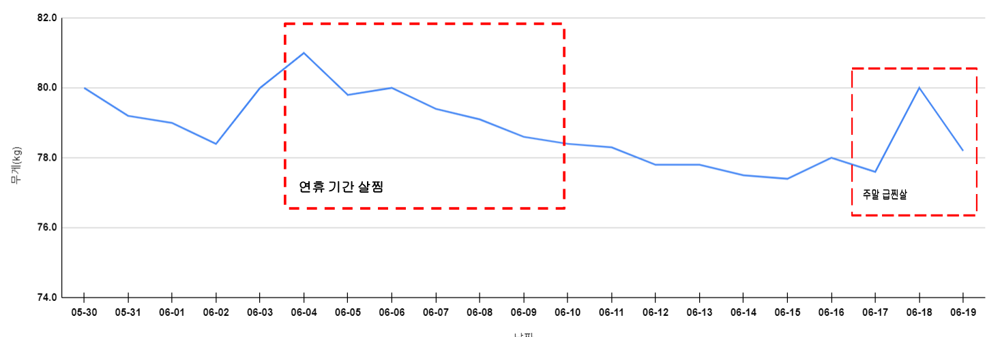

## 1. 금일 활동 내용(06.19)

* 12:00 ~ 13:00 : 운동
  * 런닝 1시간
* 19:00 ~ 21:00 : SQLP 이론서
  *  2과목 공부
* 21:00 ~ 23:00 : 운동
  * 런닝 1시간
  * 등, 가슴 3세트
  * 복근 3세트

## 2. 활동 리뷰

* (부정)주말에 계속 계획이 수행되지 않고 있다. 강력한 해결책이 필요!

##  3. 주간 목표(06.19~06.25, 3주차)

* SQLP 이론서 
  * 2과목 1회독
* SQLP 실전 문제
  * 1,2과목 1회독
* Hello Papang 서버 배포 
* 다이어트
  * 목표: 76.0kg
  * 현재: 78.2kg

## 4. 최종 목표

* SQLP 시험 합격
  * SQLP 실전 문제 3회독(1/3)
  * SQLP 이론서 3회독(0/3)
  * 오라클 튜닝 관련 도서 3회독(0/3)
* Hello Papang 개발 완료
  * 매주 1개 이상의 메뉴 개발 수행

* 몸무게 4kg 감량(30일 간 다이어트)
  * 30일 간 아침 및 저녁 운동 수행하여 79kg -> 75kg으로 4kg 이상 감량
  * 70일 간 운동하여 몸무게 유지 및 체력 증진

