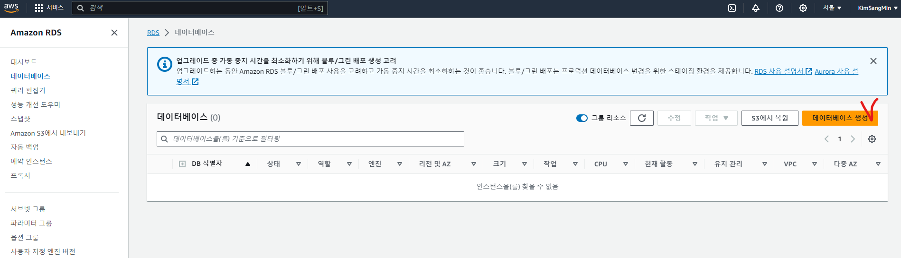
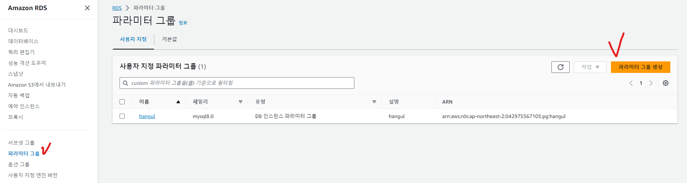
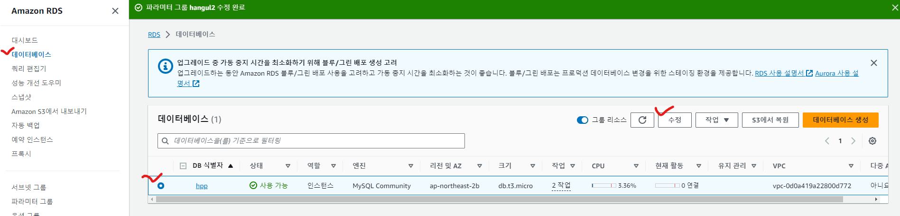
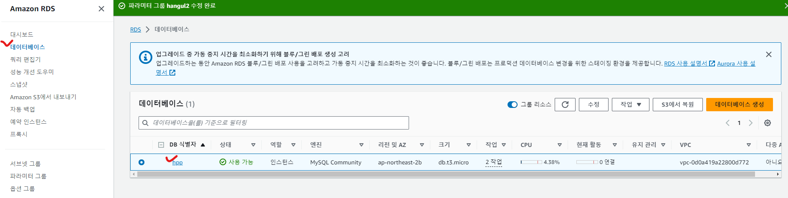
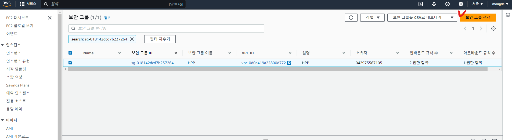
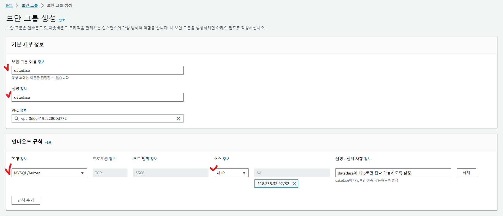
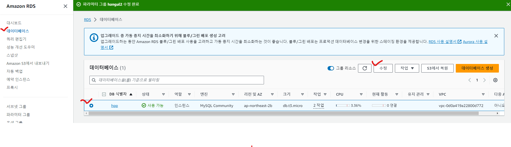
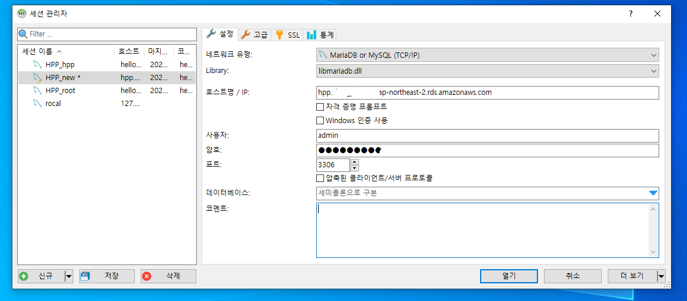

## 데이터베이스 생성

* RDS접속 - 데이터베이스 - [데이터베이스 생성] 클릭 

* 엔진 옵션 - [MySQL] 선택

* 템플릿 - [프리 티어] 선택

* 설정 - 데이터 입력

* 연결 - 퍼블릭 엑세스 - [예] 선택
  * VPC 외부(=내 서버)에서 연결하기 위해서 퍼블릭 엑세스가 필요하다.

* [데이터베이스 생성] 선택

## 파라미터 그룹 만들기

* 데이터베이스에 파라미터 그룹을 할당하여 DB 설정을 관리한다.
  * 예를 들어 인코딩 관련 설정을 utf-8로 바꿔 한글이 정상적으로 인코딩되도록 한다.

* RDS - 파라미터 그룹 - [파라미터 그룹 생성] 클릭

* 파라미터 그룹 패밀리 - DB에 맞춰서 선택
* 그룹 이름, 설명 입력
* [생성] 버튼 클릭

* 이름 클릭해서 세부 정보로 이동

* [편집] 버튼 클릭

* time_zone 검색 -> time_zone 파라미터에 Asia/Seoul 입력
* char 검색 -> 아래 6개의 파라미터에 utf8mb4 입력
  * character_set_client, character_set_connection, character_set_database, character_set_filesystem, character_set_results, character_set_server
* collation 검색 -> 아래 2개의 파라미터에 utf8mb4_general_ci 입력
  * collation_connection, collation_server

* [변경 사항 저장] 클릭

* 데이터베이스 - DB선택 - [수정] 버튼 클릭

* 스크롤... - 추가 구성 - [DB 파라미터 그룹] 설정

## 보안 그룹 설정

* 보안 그룹 설정을 통해 허용되지 않은 ip에서의 접근을 차단한다

* 데이터베이스 - DB선택

* VPC 보안 그룹 선택

* [보안 그룹 생성] 클릭

* 보안 그룹 이름, 설명 입력
* 유형 - [MYSQL/Aurora] 선택
  * 자동으로 3306포트 배정 된다
  * 적당히 필요한 유형 선택하면 됨
* 소스 - [내 IP] 선택
  * 설명에 한글 쓰면 오류남...

* 제일 아래 [보안 그룹 생성] 클릭

* RDS - 데이터베이스  - DB선택 - [수정] 클릭

* 연결 - [보안 그룹] 선택 

* [계속] 클릭 - [즉시 적용] 선택 - [DB 인스턴스 수정] 클릭

# HeidiSQL을 통한 연결 테스트

* 호스트명/IP에 엔드포인트 입력
* 사용자는 DB 생성할 때 입력한 마스터 사용자 이름(기본값 admin)
