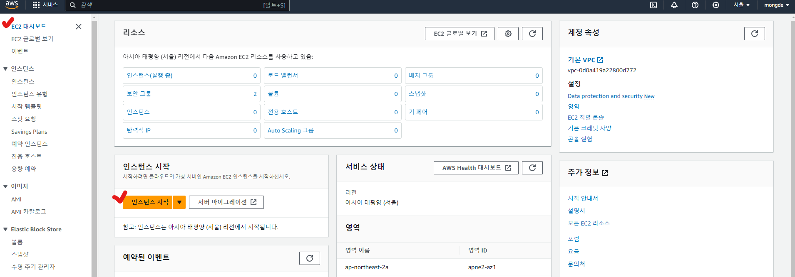
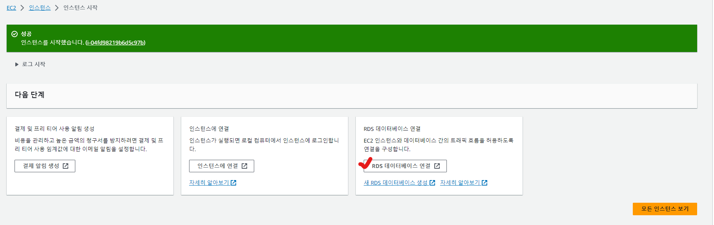
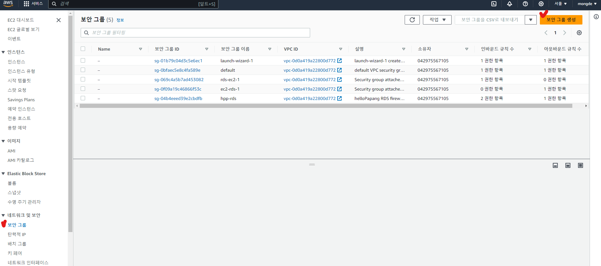
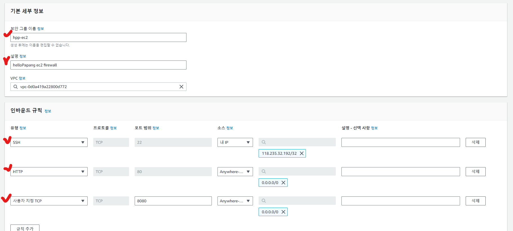
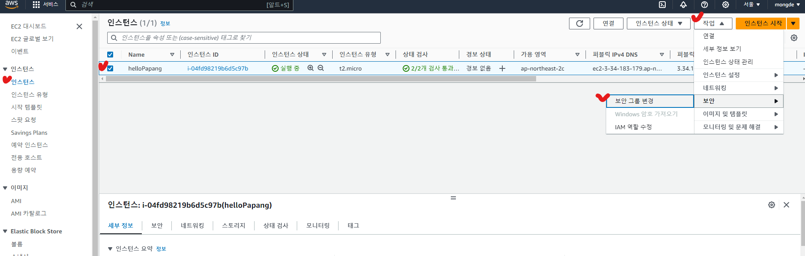
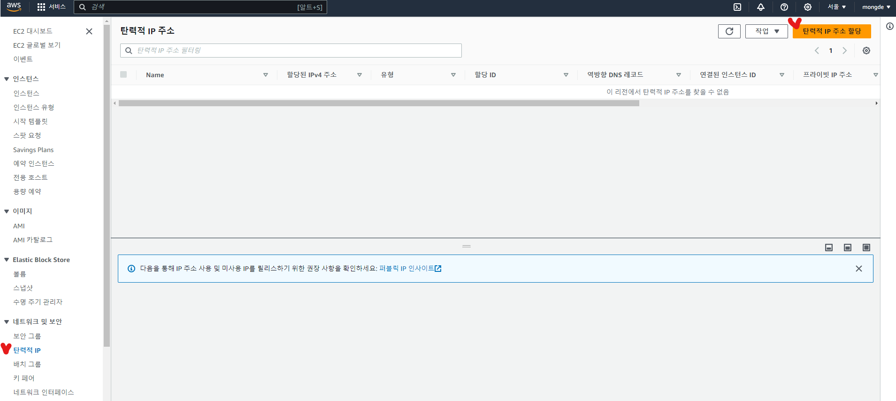
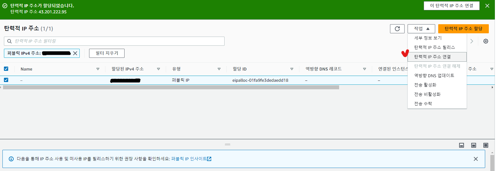

## EC2 생성

* EC2대시보드 - [인스턴스 시작] 클릭

* 이름 입력

* 키 페어(로그인) - [새 키 페어 생성] 클릭

* 키 페어 이름 입력 - ppk 선택(PuTTy로 접속하기 위해) - [키 페어 생성] 클릭
* **다운로드 되는 .ppk 파일 잘 보관하기!**

* 네트워크 설정 - Firewall - 내IP 선택(다른 IP에서 접근 불가)
* [인스턴스 시작] 클릭

* [RDS 데이터베이스 연결] 클릭

* 인스턴스 선택
* 생성한 RDS 데이터베이스 선택
* [연결] 클릭

## 보안 그룹 설정하기

* EC2 대시보드 - 인스턴스(실행 중)

* 보안 그룹 - 보안 그룹 생성

* 보안 그룹 이름, 설명 입력
* [규칙 추가]를 눌러 인바운드 규칙 설정
  * 80, 8080포트는 어떤 ip에서 접속해도 상관 없지만 22포트 접속은 위험하므로 허용된 ip외에는 차단해야 한다!

* 아래로 스크롤... - [보안 그룹 생성] 클릭

* EC2 - 인스턴스 - 인스턴스 선택 - 작업 - 보안- 보안 그룹 변경

* 보안 그룹 선택 - 보안 그룹 추가 - 저장

## 탄력적 IP 주소 할당

* 탄력적 IP를 할당하지 않은 채로 EC2인스턴스를 재부팅하게 되면, IP주소가 변경되므로, 고정 ip를 할당하는 개념 

* EC2 - 탄력적 IP - 탄력적 IP 주소 할당

* [할당] 클릭

* [탄력적 IP 주소 연결] 클릭

* 인스턴스 선택 - 연결

## PuTTy로 연결 테스트

* Putty - IP입력

* Connection - SSH - Auth - Credentials 이동 - 키 페어(로그인)에서 생성한 .ppk 파일 등록

* Connection - Data - Auto-login username - [ec2-user] 입력

* Session - [Saved Sessions]에서 저장 대상 선택 - Save 
* Open

