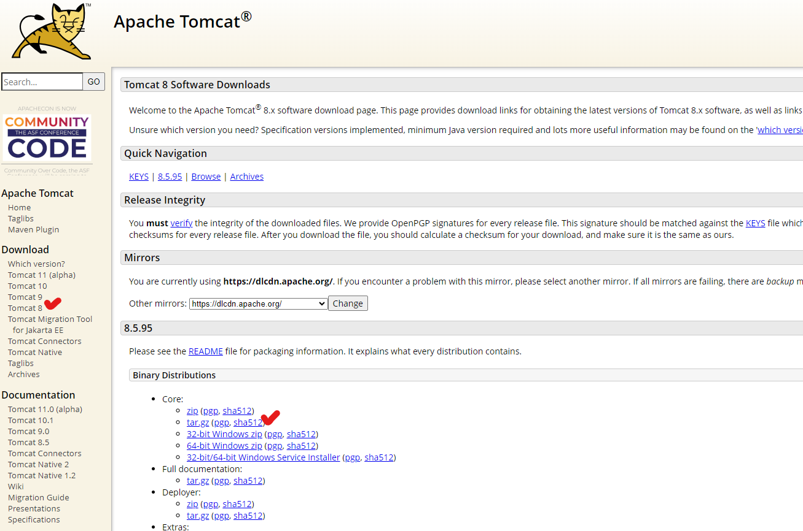

## JAVA 설치

* Java 설치 가능한 리스트 검색

```
yum list java*
```


* java 11 설치

``` 
sudo yum install java-11-amazon-corretto.x86_64
```


* java 버전 확인

```
java -version
```


#### 참고

AWS EC2 Java 설치(https://vvshinevv.tistory.com/107)


## Tomcat 설치

* 적당한 경로 설정

```
[ec2-user@ip-000-000-000-000 ~]$ mkdir server
[ec2-user@ip-000-000-000-000 ~]$ cd server/
```


* 톰캣 설치



* 톰캣 공식 사이트(https://tomcat.apache.org/) 접속
* Download - 원하는 tomcat 버전 - tar.gz(링크 주소 복사)
* 명령창에 입력해서 압축파일 다운로드 및 압축 해제

```
[ec2-user@ip-000-000-000-000 server]$ wget https://dlcdn.apache.org/tomcat/tomcat-8/v8.5.95/bin/apache-tomcat-8.5
[ec2-user@ip-000-000-000-000 server]$ tar -zxvf apache-tomcat-8.5.95.tar.gz
```


* 톰캣 실행

```
[ec2-user@ip-000-000-000-000 server]$ ./apache-tomcat-8.5.95/bin/startup.sh
```


* 실행 확인
  * 주소 예시: http://192.168.123.456:8080/


