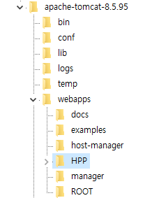

## WAR 파일 생성


* 프로젝트 우클릭 - Run As - Maven Install

=> 프로젝트 우클릭 - Export - WAR file은 안 되더라...




* 다운받은 WAR 파일을 FTP를 이용해서 서버의 tomcat 경로 webapps 디렉토리 하위에 저장  


```xml
<Host name="localhost"  appBase="webapps" unpackWARs="true" autoDeploy="true">	<!-- 기존 코드 -->
    <Context path="/" docBase="HPP" reloadable="false" /> <!-- 추가 코드 -->
</Host>
```

* 서버의 tomcat 경로에서 conf/server.xml 파일에 \<Context path="/" docBase="[WAR파일명]" reloadable="false" /> 추가


```
[ec2-user@ip-000-000-000-000 server]$ /apache-tomcat-8.5.95/bin/startup.sh
```

* 서버에서 tomcat 실행


#### 참고

* [Tomcat에 WAR 파일 배포해서 기동하기](https://oingdaddy.tistory.com/344)
* [Tomcat에 war 배포하는 방법](https://www.lifencoding.com/web/28?p=1)
