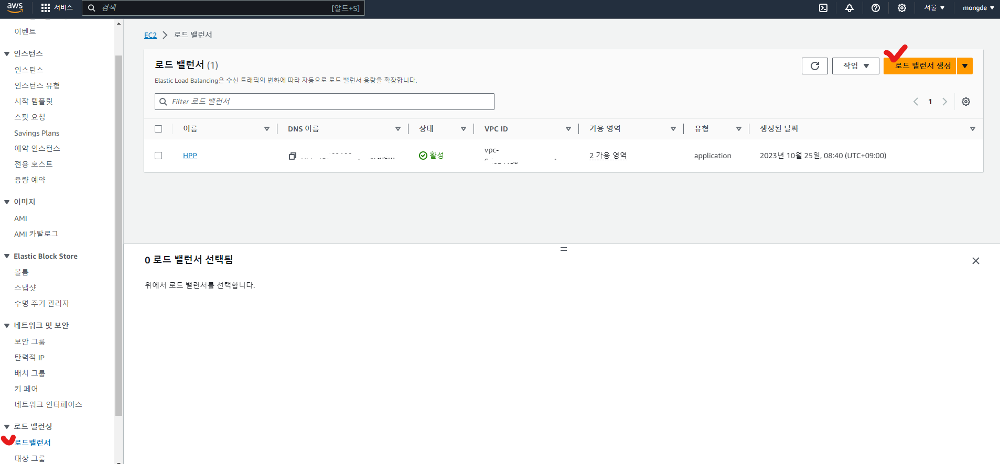
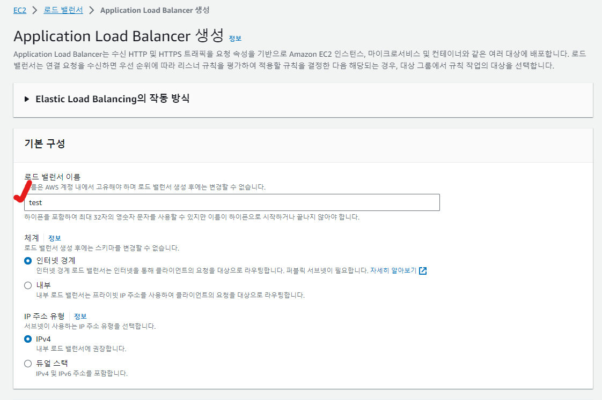
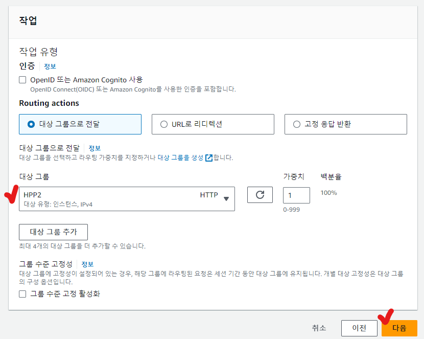

#### [* HTTPS, SSL을 왜 사용할까?](https://lollaziest.tistory.com/118)


## Certificate Manager를 통한 SSL 인증서 발급


* AWS Certificate Manager - 인증서 요청 - 퍼블릭 인증서 요청 - [다음] 클릭


* [완전히 정규화된 도메인 이름] 입력 - [요청] 클릭

**<span style = "color:blue"># AWS에서 미리 구매한 도메인이 있어야 한다!</span>**


* [인증서 ID] 클릭


* [CNAME 이름]에 값이 있는지 확인(없으면 잠시 후 새로고침) - [Route 53에서 레코드 생성] 클릭


* 도메인 선택 - [레코드 생성] 클릭 - 잠시 기다리면 인증서 상태가 [발급됨]으로 변함


#### 로드 밸런서 생성



* EC2 - 로드 밸런서 - [로드 밸런서 생성] 클릭


* Application Load Balancer [생성] 클릭




* [로드 밸런서 이름] 입력


* [보안 그룹] 선택
  * 모든 ip에 대해 80, 8080, 443 포트가 열려야한다.


#### 대상 그룹 생성

**<span style = "color:blue"># 리스너에서 선택할 대상 그룹을 다른 페이지에서  생성 후 진행할 예정</span>**


* [리스너 및 라우팅] - [대상 그룹 생성] 클릭


* [기본 구성] - [대상 그룹 이름] 입력
* [프로토콜] HTTP 선택 - [포트] 80 입력


* [상태 검사] - [상태 검사 경로] 입력
  
  [다음] 클릭


* 인스턴스 선택 - [80]포트 입력 - [아래에 보류 중인 것으로 포함] 클릭
* [대상 그룹 생성] 클릭


[Backend 대상 그룹도 생성]

* [기본 구성] - [대상 그룹 이름] 입력

* [프로토콜] HTTP 선택 - [포트] 8080 입력

* [상태 검사] - [상태 검사 경로] 입력

  [다음] 클릭

* 인스턴스 선택 - [8080]포트 입력 - [아래에 보류 중인 것으로 포함] 클릭

* [대상 그룹 생성] 클릭


/image-20251231153510711.png)

* EC2 - 대상 그룹 - [이름] 클릭
* 영역 부분 확인하기


**<span style = "color:blue"># 리스너에서 선택할 대상 그룹 생성 완료, 다시 로드 밸런서 생성하던 화면으로 이동!</span>**


* 위로 스크롤 - [네트워크 매핑] - 위에서 확인한 영역에 맞는 [매핑] 선택


* [프로토콜] HTTP 선택 - [포트] 80 선택 - [기본 작업] 생성한 대상 그룹 선택(대상 그룹 안 보이면 새로고침 버튼)
* [리스너 태그 추가] 클릭 - [프로토콜] HTTPS 선택 - [포트] 443 선택 - [기본 작업] 생성한 대상 그룹 선택


* [보안 리스너 설정] - 인증서 선택

* [로드 밸런서 생성] 클릭


* EC2 - 로드 밸런서 - 목록에서 생성한 로드 밸런서 선택 - 아래 [리스너 및 규칙] 탭에서 80포트의 [규칙]을 선택


* [리스너 규칙] 탭에서 [규칙 추가] 클릭


* [Name] 입력 - [다음] 클릭


* [조건 추가] 클릭


* [규칙 조건 유형]에 호스트 헤더 선택 - [호스트 헤더]에 도메인 이름 입력 - [확인] 클릭
  * (호스트 헤더 = 도메인 이름)이라고 생각하면 된다.


* [다음] 클릭


* [URL로 리디렉션] 선택 - 포트에 [443]입력 - [다음] 클릭


* [우선 순위] 입력 - [다음] 클릭 - [생성] 클릭


* EC2 - 로드 밸런서 - 목록에서 생성한 로드 밸런서 선택 - 아래 [리스너 및 규칙] 탭에서 443포트의 [규칙]을 선택


* [리스너 규칙] 탭에서 [규칙 추가] 클릭


* [Name] 입력 - [다음] 클릭


* [조건 추가] 클릭


* [규칙 조건 유형]에 호스트 헤더 선택 - [호스트 헤더]에 도메인 이름 입력 - [확인] 클릭


* [다음] 클릭




* [대상 그룹] 선택 - [다음] 클릭


* [우선 순위] 입력 - [다음] 클릭 - [생성] 클릭


#### Route 53과 로드 밸런서 연결하기


* Route 53 - 호스팅 영역 - 목록에서 호스팅 영역 이름 선택
* 유형이 [A]인 레코드 선택 - [레코드 편집] 클릭
* [별칭] 활성화 - 트래픽 라우팅 대상에서 [Application/Classic Load Balancer에 대한 별칭] 선택 - [아시아 태평양(서울)] 선택 - 로드밸런서 선택 - [저장] 클릭


**<span style = "color:blue">HTTPS 적용 완료! 이제 [https://도메인]으로 접속하면 (안) 된다... 원래 돼야하는데 안 되더라... 아래 내용을 참고하자!</span>**

=> 안 해도 된다,, 시간 기다리면 열린다.. 502에러 나면 새로고침하면서 기다리자...


#### 서버 방화벽 열기

* putty로 EC2 접속 후 아래 명령어 수행

```bash

## root로 로그인
[ec2-user@ip-192-168-999-999 ~]$ sudo su

## firewalld 깔려있는지 확인
[root@ip-192-168-999-999 ec2-user]# firewall-cmd --version

## firewalld 깔려 있으면 종료
[root@ip-192-168-999-999 ec2-user]# systemctl stop firewalld
[root@ip-192-168-999-999 ec2-user]# systemctl mask firewalld

## 시작 시 부팅되는 서비스 목록 조회 ==> 방화벽 관련 서비스가 있으면 종료 시키자!
[root@ip-192-168-999-999 ec2-user]# systemctl list-unit-files --type=service | grep enabled

## iptables 서비스 설치
[root@ip-192-168-999-999 ec2-user]# yum install iptables
[root@ip-192-168-999-999 ec2-user]# yum install iptables-services

## iptables 설치 확인
[root@ip-192-168-999-999 ec2-user]# rpm -qa | grep iptables

## iptables 서비스 종료
[root@ip-192-168-999-999 ec2-user]# systemctl stop iptables

## iptables 서비스 작동 확인
[root@ip-192-168-999-999 ec2-user]# systemctl status iptables

## 포트 열기
[root@ip-192-168-999-999 ec2-user]# iptables -I INPUT 1 -p tcp --dport 80 -j ACCEPT
[root@ip-192-168-999-999 ec2-user]# iptables -I INPUT 1 -p tcp --dport 8080 -j ACCEPT
[root@ip-192-168-999-999 ec2-user]# iptables -I INPUT 1 -p tcp --dport 443 -j ACCEPT

## 방화벽 규칙을 조회
[root@ip-192-168-999-999 ec2-user]# sudo iptables -L -v -n

## 포트 포워딩
[root@ip-192-168-999-999 ec2-user]# iptables -A PREROUTING -t nat -i eth0 -p tcp --dport 80 -j REDIRECT --to-port 8080
[root@ip-192-168-999-999 ec2-user]# iptables -A PREROUTING -t nat -i eth0 -p tcp --dport 443 -j REDIRECT --to-port 8080

## 포트 포워딩 조회
[root@ip-192-168-999-999 ec2-user]# sudo iptables -t nat -L PREROUTING
```


#### 참고

* [EC2 HTTPS 및 로드밸런서 적용](https://jindevelopetravel0919.tistory.com/192)
* [EC2 로드밸런서 502 Bad Gateway 해결기](https://velog.io/@yevini118/AWS-EC2-%EB%A1%9C%EB%93%9C%EB%B0%B8%EB%9F%B0%EC%84%9C-502-Bad-Gateway-%ED%95%B4%EA%B2%B0%EA%B8%B0)
* [EC2 ALB 연결 후 503 Service Temporarily Unavailable](https://mumomu.tistory.com/123)
* [iptables 서비스 설치](https://jaynamm.tistory.com/entry/CentOS-7-iptables-서비스-설치-및-동작)

* [AWS 서버에 서버 프로그램 돌려놨는데 외부에서 접속이 안 될 때 (리눅스 포트 여는 방법)](https://breakcoding.tistory.com/327)

* [AWS EC2 iptables를 통해 서버 포트 포워딩](https://zzang9ha.tistory.com/331#google_vignette)

