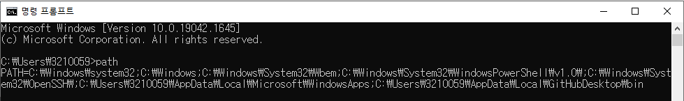

## 환경변수

* 프로세스가 컴퓨터에서 동작하는 방식에 영향을 미치는, 동적인 값들의 모임이다.

## 환경변수를 설정하는 이유

* 운영체제가 명령을 수행하기 위한 탐색 경로 설정 => 어느 경로에서 명령어를 던져도 같은 파일이 실행된다!
* 운영체제가 명령을 받았을 때의 동작 순서

1. 현재 위치한 디렉토리에 해당 명령어가 있는지 확인
2. Path라는 환경변수가 가지고 있는 모든 경로에 대해서 입력된 명령어가 존재하는지 확인 
3. 명령어를 발견하지 못하면 에러 메세지를 출력

## 환경변수 확인

* 명령 프롬프트에서 path 입력

## 참고

<a href="https://ko.wikipedia.org/wiki/%ED%99%98%EA%B2%BD_%EB%B3%80%EC%88%98" target="_blank">위키백과(환경변수)</a>

<a href="https://www.lifencoding.com/software/26?p=1" target="_blank">환경변수를 설정하는 이유(블로그)</a>

