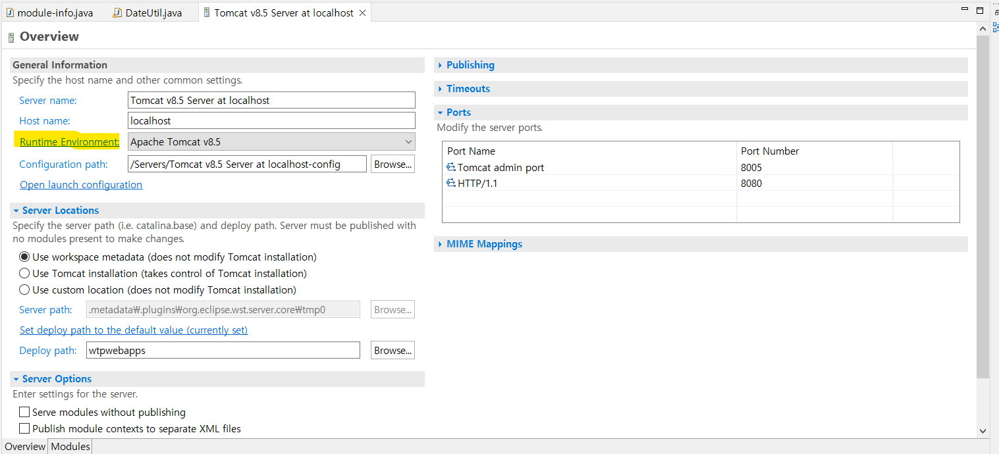
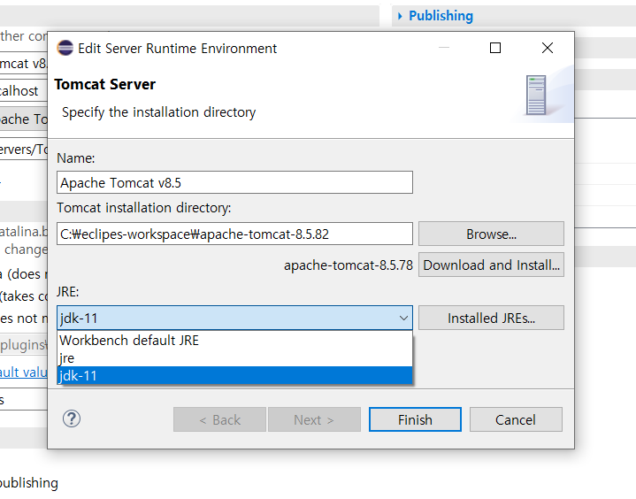

## 상황

* svn을 통해 정상 동작하는 프로젝트를 check out 하고 서버에서 실행하였는데, BeanCreationException 발생

## 원인

* PC에 두 개의 JDK 파일이 있었으며, 톰캣 서버 생성 시 JDK 버전을 잘못 선택함

## 해결

* [이클립스 서버 overview] - [Runtime Environment] - JRE 수정 

## 기타

* 환경변수, java build path 모두 확인 했으나 정상적인 JDK 버전을 설정하고 있어 오류 파악이 어려웠음 

