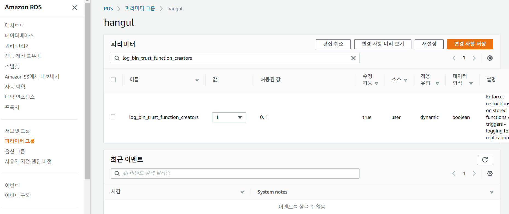

##  1. 시퀀스를 저장할 테이블 생성

```sql
CREATE TABLE `TB_SEQUENCE` (
	`SEQ_NM`	VARCHAR(30)	NOT NULL	COMMENT '시퀀스명',
	`CURRVAL`	BIGINT	NULL	COMMENT '현재 값'
);

ALTER TABLE `TB_SEQUENCE` ADD CONSTRAINT `PK_TB_SEQUENCE` PRIMARY KEY (
	`SEQ_NM`
);
```

## 2. 시퀀스를 생성하는 프로시저 생성

```sql
DELIMITER $$
    CREATE PROCEDURE `create_sequence` (IN the_name text)
    MODIFIES SQL DATA
    DETERMINISTIC
    BEGIN
        DELETE FROM TB_SEQUENCE WHERE SEQ_NM = the_name;
        INSERT INTO TB_SEQUENCE VALUES(the_name, 0);
   END
```

## 3. 시퀀스의 다음 값을 가져오는 함수 생성

```sql
DELIMITER $$
    CREATE FUNCTION `nextval` (the_name VARCHAR(30))
    RETURNS BIGINT UNSIGNED
    MODIFIES SQL DATA
    DETERMINISTIC
    BEGIN
        DECLARE ret BIGINT UNSIGNED;
        UPDATE TB_SEQUENCE SET CURRVAL = CURRVAL +1 WHERE SEQ_NM = the_name;
        SELECT CURRVAL INTO ret FROM TB_SEQUENCE WHERE SEQ_NM = the_name LIMIT 1;
        RETURN ret;
   END
```

## 4. 프로시저를 이용해 시퀀스 생성 및 nextval 조회

```sql
CALL create_sequence('Test');	#시퀀스 생성

SELECT nextval('Test') FROM DUAL;	#nextval 조회
```


##  # 오류 사례 1

* 시퀀스의 다음 값을 가져오는 함수 생성할 때 아래와 같은 오류 발생

```sql
DELIMITER $$
    CREATE FUNCTION `nextval` (the_name VARCHAR(30))
    RETURNS BIGINT UNSIGNED
    MODIFIES SQL DATA
    DETERMINISTIC
    BEGIN
        DECLARE ret BIGINT UNSIGNED;
        UPDATE TB_SEQUENCE SET CURRVAL = CURRVAL +1 WHERE SEQ_NM = the_name;
        SELECT CURRVAL INTO ret FROM TB_SEQUENCE WHERE SEQ_NM = the_name LIMIT 1;
        RETURN ret;
   END
   

/* SQL 오류 (1419): You do not have the SUPER privilege and binary logging is enabled (you might want to use the less safe log_bin_trust_function_creators variable) */
```


1. aws접속 후 파라미터 변경



2. Confluence 권한 부여

```sql
GRANT ALL PRIVILEGES ON confluence.* TO 'hpp'@'%';
```

3. 기존 소스 실행

```sql
DELIMITER $$
    CREATE FUNCTION `nextval` (the_name VARCHAR(30))
    RETURNS BIGINT UNSIGNED
    MODIFIES SQL DATA
    DETERMINISTIC
    BEGIN
        DECLARE ret BIGINT UNSIGNED;
        UPDATE TB_SEQUENCE SET CURRVAL = CURRVAL +1 WHERE SEQ_NM = the_name;
        SELECT CURRVAL INTO ret FROM TB_SEQUENCE WHERE SEQ_NM = the_name LIMIT 1;
        RETURN ret;
   END
```


## 참고

<a href="https://proudin.tistory.com/entry/MySql%EC%97%90%EC%84%9C-Sequence-%EA%B8%B0%EB%8A%A5%EC%9D%84-%EC%82%AC%EC%9A%A9%ED%95%98%EB%8A%94-%EB%B0%A9%EB%B2%95" target="_blank">MySql에서 Sequence 기능을 사용하는 방법</a>

<a href="https://xively.tistory.com/26">aws파라미터 변경</a>

<a href="https://www.lesstif.com/dbms/mysql-1419-error-you-do-not-have-the-super-privilege-and-binary-logging-is-enabled-106856957.html">MySQL 1419 error - "You do not have the SUPER privilege and binary logging is enabled" 해결 방법</a>
