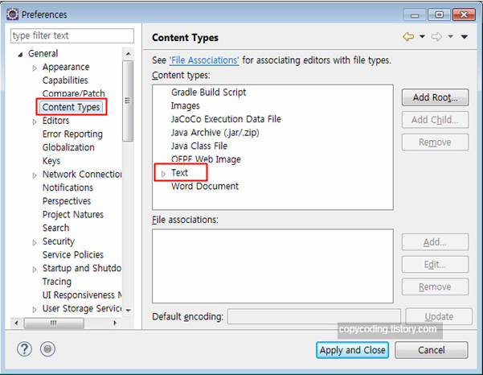
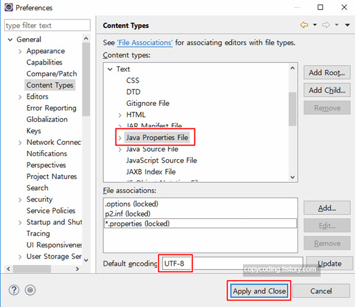

##  properties 파일 한글 깨짐 방지

1.  Window > Preferences > General Content > Types > Text

2. Java Properties File 선택 > Default encoding 입력란에 ISO-8859-1 등이 입력되어 있다면 UTF-8을 입력

   

## 참고

<a href="https://copycoding.tistory.com/271" target="_blank">eclipse properties 파일 한글 깨짐 해결 설정</a>

