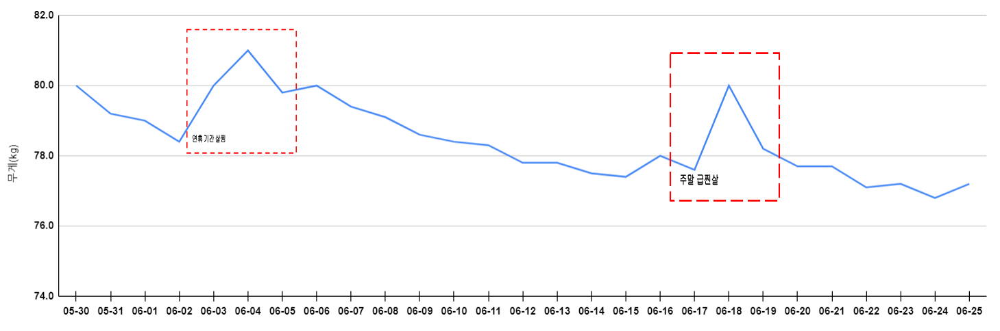

## 1. 금일 활동 내용(06.24)

* 07:00 ~ 08:00 : 운동
  * 런닝 1시간
* 21:00 ~ 23:00 : 운동
  * 런닝 1시간
  * 등, 가슴 5세트
  * 복근 3세트

## 2. 활동 리뷰

* (긍정) 주말에도 운동을 빼먹지 않고 하여 몸무게를 유지함

* (부정) 공부하려고 책상 앞에 앉아서 유튜브만 보고 놀았음

* 주말 계획

  [금요일]

  * 저녁 X (간식 많이 먹었음)
  * 17:00 ~ 21:00 : Hello Papang 서버 배포 
  * 21:00 ~ 23:00 : 운동

  [토요일]

  * 09:00 ~ 09:30 : 청소 및 집안일
  * 09:30 ~ 10:00 : 아파트 세대 방역
  * 10:00 ~ 12:00 : 운동

  * 12:00 ~ 14:00 : 점심
  * 14:00 ~ 18:00 : SQLP 이론서 2과목 공부
  * 18:00 ~ 20:00 : 운동
  * 20:00 ~ 22:00 : SQLP 실전 문제 1과목

  [일요일]

  * 07:00 ~ 09:00 : 운동
  * 09:00 ~ 12:00 : SQLP 이론서 2과목 공부

  * 12:00 ~ 14:00 : 점심
  * 14:00 ~ 18:00 : SQLP 이론서 2과목 공부
  * 18:00 ~ 20:00 : 운동

##  3. 주간 목표(06.19~06.25, 3주차)

* SQLP 이론서 
  * 2과목 1회독
* SQLP 실전 문제
  * ~~1,2과목 1회독~~ -> 1과목 1회독
* Hello Papang 서버 배포 
* 다이어트
  * 목표: 76.0kg
  * 현재: 76.8kg

## 4. 최종 목표

* SQLP 시험 합격
  * SQLP 실전 문제 3회독(1/3)
  * SQLP 이론서 3회독(0/3)
  * 오라클 튜닝 관련 도서 3회독(0/3)
* Hello Papang 개발 완료
  * 매주 1개 이상의 메뉴 개발 수행

* 몸무게 4kg 감량(30일 간 다이어트)
  * 30일 간 아침 및 저녁 운동 수행하여 79kg -> 75kg으로 4kg 이상 감량
  * 70일 간 운동하여 몸무게 유지 및 체력 증진

