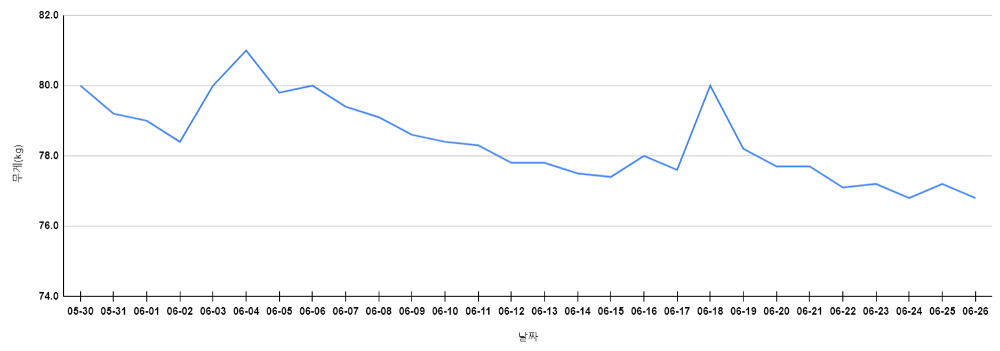

## 1. 금일 활동 내용(06.26)

* 07:00 ~ 08:00 : 운동
  * 런닝 1시간
* 12:00 ~ 13:00 : SQLP 이론서
  * 2과목 공부
* 20:00 ~ 22:00 : SQLP 실전 문제
  * 1과목 공부

* 22:00 ~ 23:00 : 운동
  * 런닝 1시간
  * 팔 3세트

## 2. 활동 리뷰

* (부정) 주말에 계속 공부 안 하고 놀고 있음
  * 주간 목표를 달성하지 못 했을 때 패널티를 적용하자
    * 이번 주 평일 식사 시간에 유튜브 시청 금지 및 공부할 때 쪽잠 금지 패널티 적용 예정

##  3. 주간 목표(06.26~07.02, 4주차)

* SQLP 이론서 
  * 2과목 1회독(3주차 미수행)
* SQLP 실전 문제
  * 1과목 1회독(3주차 미수행)
  * 2과목 1회독
* Hello Papang 서버 배포(3주차 미수행)
* Hello Papang 에디터 고도화
* 다이어트
  * 목표: 75.0kg
  * 현재: 76.8kg

## 4. 최종 목표

* SQLP 시험 합격
  * SQLP 실전 문제 3회독(1/3)
  * SQLP 이론서 3회독(0/3)
  * 오라클 튜닝 관련 도서 3회독(0/3)
* Hello Papang 개발 완료
  * 매주 1개 이상의 메뉴 개발 수행

* 몸무게 4kg 감량(30일 간 다이어트)
  * 30일 간 아침 및 저녁 운동 수행하여 79kg -> 75kg으로 4kg 이상 감량
  * 70일 간 운동하여 몸무게 유지 및 체력 증진

